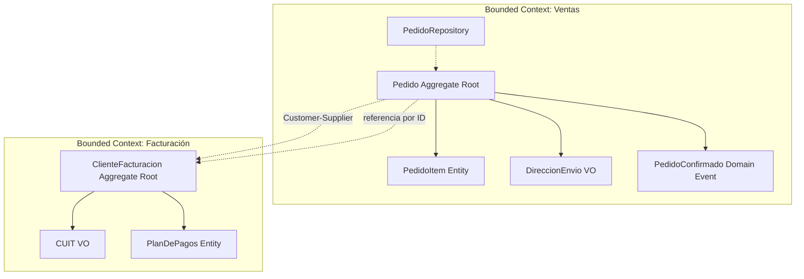

# 📗 Concept: Domain-Driven Design (DDD)
> **Tags:** #engineering #learning #pkm #ddd #architecture
> **Type:** Architecture / Pattern

## 📖 The 80/20 Essence (Resumen Core)

DDD es una filosofía de diseño de software que dice: **el código debe hablar el mismo idioma que el negocio**. No se trata de tecnología ni de frameworks — se trata de que el modelo en código refleje fielmente las reglas y conceptos del dominio (el negocio).

Se compone de dos partes:

### DDD Estratégico (los límites)
- **Bounded Contexts:** Límites explícitos donde un modelo de dominio tiene sentido. Un mismo concepto ("Cliente", "Producto") puede tener modelos distintos en contextos distintos.
- **Context Mapping:** Patrones de relación entre bounded contexts (Customer-Supplier, Anti-Corruption Layer, Conformist, Partnership).
- **Regla clave:** Un Bounded Context = un microservicio (en la mayoría de los casos).

### DDD Táctico (los building blocks)
| Building Block     | Qué es                                                    | Regla clave                                                         |
| ------------------ | --------------------------------------------------------- | ------------------------------------------------------------------- |
| **Entity**         | Tiene identidad única (ID) que no cambia                  | Se compara por ID, no por atributos                                 |
| **Value Object**   | Se define por sus atributos, es inmutable                 | Se compara por contenido; si cambiás un atributo, creás uno nuevo   |
| **Aggregate**      | Grupo de Entity + VO que forman una unidad coherente      | Siempre se accede a través del Aggregate Root                       |
| **Aggregate Root** | La Entity principal, única puerta de entrada al Aggregate | Referencia a otros Aggregates solo por ID, nunca por objeto directo |
| **Domain Event**   | Algo que ya pasó en el dominio y es relevante             | Es inmutable; representa un hecho, no una intención                 |
| **Repository**     | Abstracción para persistir/recuperar Aggregates           | Solo trabaja con Aggregate Roots                                    |
| **Domain Service** | Lógica de dominio que no pertenece a una Entity sola      | Último recurso — si podés ponerla en una Entity, ponela ahí         |

## 🎯 Context & Evolution (Evolución y Contexto)

| Era | Enfoque | Problema |
|-----|---------|----------|
| **Legacy (Anémico)** | Clases con getters/setters, lógica en servicios, nombres técnicos (`OrderDTO`, `setStatus`) | El código no refleja el negocio; los devs y el negocio hablan idiomas distintos |
| **DDD (Rico en dominio)** | Clases con comportamiento, lenguaje ubicuo, nombres de negocio (`Pedido.confirmar()`) | El código ES el negocio; cualquier stakeholder puede leerlo y entenderlo |

## ⚖️ Trade-offs (Ventajas y Desventajas)

- **Pros:**
  - Código que refleja el negocio → más fácil de mantener y extender
  - Límites claros (Bounded Contexts) → base natural para microservicios
  - Aggregates como unidades de consistencia → menos bugs por estados inválidos
  - Domain Events → comunicación desacoplada entre componentes

- **Cons:**
  - Curva de aprendizaje significativa
  - Over-engineering si el dominio es simple (CRUD básico)
  - Requiere colaboración cercana con expertos del negocio
  - No todos los problemas necesitan DDD completo

## 🗺️ Visual Logic (Diagrama Mermaid)

## 💡 Engineering Insight (Lección Clave)

**DDD no es sobre código — es sobre comunicación.** Si tu equipo no puede nombrar un concepto del negocio sin ambigüedad, ningún patrón técnico va a salvar el proyecto. Empezá por el lenguaje, no por la arquitectura.

**Regla práctica:** Si no podés explicar tu Aggregate a un experto del negocio en 2 minutos, probablemente está mal diseñado.

## 🔗 Related Concepts
- [[acoplamiento]] — Extension: DDD reduce el acoplamiento mediante Bounded Contexts y referencias por ID entre Aggregates
- [[microservicios]] — Prerequisite: DDD es la base para definir los límites correctos de cada microservicio

---

## ✍️ Mi Resumen Personal
*(Espacio reservado para que el usuario complete con sus propias palabras tras la lectura)*
