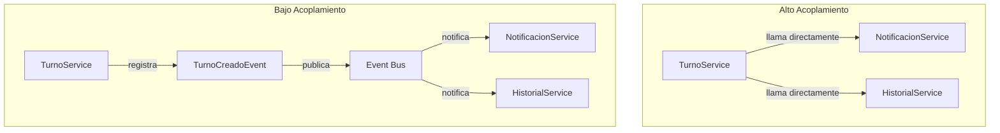

# 📗 Concept: Acoplamiento (Coupling)
> **Tags:** #engineering #learning #pkm #architecture #ddd
> **Type:** Architecture / Best-Practice

## 📖 The 80/20 Essence (Resumen Core)
El **acoplamiento** mide cuánto conoce y depende un componente de otro para funcionar.
- **Alto acoplamiento:** Si cambio A, se rompe B. El conocimiento es directo y fuerte (ej: instanciar una clase concreta, llamar a su método directamente).
- **Bajo acoplamiento:** Cambio A y B no se entera. La dependencia es a través de contratos o eventos (ej: interfaces, Domain Events).

El objetivo no es "acoplamiento cero" (imposible), sino **acoplamiento intencional y débil** donde sea necesario cambiar con frecuencia.

## 🎯 Context & Evolution (Evolución y Contexto)
| Era | Mentalidad | Resultado |
|-----|-----------|-----------|
| **Legacy (Monolito CRUD)** | "Todo junto, total funciona" | Cambiar un módulo requiere regression testing de TODO. Miedo a tocar código. |
| **Moderno (DDD/Event-Driven)** | "Cada parte conoce lo mínimo indispensable" | Podés reemplazar módulos sin tocar otros. Confianza para cambiar. |

**Ejemplo DDD:**
- ❌ `Order` llama a `EmailService.send()` → Alto acoplamiento (Order sabe de emails).
- ✅ `Order` emite `OrderPaidEvent` → Bajo acoplamiento (Order no sabe quién escucha).

## ⚖️ Trade-offs (Ventajas y Desventajas)
- **Pros:**
  - **Aislamiento de fallos:** Si el listener falla, el core sigue funcionando.
  - **Extensibilidad:** Agregar nuevos comportamientos sin tocar código existente (Open/Closed Principle).
  - **Testabilidad:** Podés testear el core mockeando solo el evento, no servicios externos.
- **Cons:**
  - **Complejidad:** Más componentes, más indirección.
  - **Consistencia Eventual:** Los listeners no se ejecutan instantáneamente; hay un lapso de inconsistencia.
  - **Debugging:** Seguir el flujo de ejecución es más difícil (no hay un stack trace lineal).

## 🗺️ Visual Logic (Diagrama Mermaid)

## 💡 Engineering Insight (Lección Clave)
El acoplamiento no es solo sobre código; es sobre **cómo se propagan los cambios**. Si un cambio de negocio requiere tocar 5 archivos en módulos distintos, tenés un problema de acoplamiento. Los Domain Events son la herramienta principal para desacoplar comportamientos secundarios del flujo core del negocio.

## 🔗 Related Concepts
- [[domain-driven-design]] — Complementario: DDD usa eventos para desacoplar bounded contexts.
- [[bounded-contexts]] — Extension: Los Bounded Contexts se comunican desacoplados via Domain Events e IDs mínimos
- [[eventual-consistency]] — Contraste: El bajo acoplamiento asíncrono introduce consistencia eventual.
- [[domain-events]] — Prerrequisito: El mecanismo principal para lograr bajo acoplamiento en DDD.

---

## ✍️ Mi Resumen Personal
*(Espacio reservado para que el usuario complete con sus propias palabras tras la lectura)*
