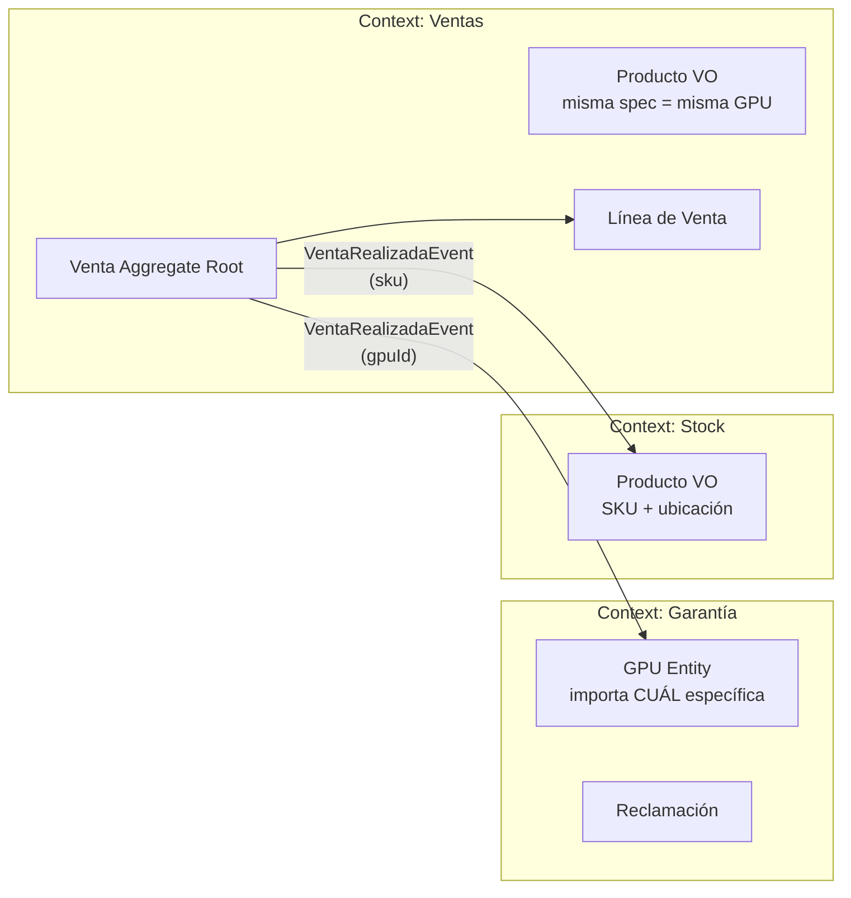

# 📗 Concept: Bounded Contexts
> **Tags:** #engineering #learning #pkm #ddd #architecture
> **Type:** Architecture / Pattern

## 📖 The 80/20 Essence (Resumen Core)

Un **Bounded Context** es un límite explícito donde un modelo de dominio tiene un único significado consistente. Es la frontera donde el **Ubiquitous Language** es unívoco: las palabras significan lo mismo para todos dentro de ese borde.

**La prueba decisiva:** Donde cambia el lenguaje, cambia el contexto.

Si "Producto" significa "algo que se vende con precio y stock" en Ventas, pero significa "un item genérico de inventario con SKU y ubicación" en Almacén, **son dos contextos distintos** con dos modelos de "Producto" diferentes.

### Identificación: Lo que NO define un contexto

- ❌ No se define por **Entities individuales** (no es "un contexto por Entity")
- ❌ No se define por **atributos distintos** (no es "los campos cambian")
- ❌ No se define por **tablas de base de datos** (mentalidad CRUD, no DDD)

### Identificación: Lo que SÍ define un contexto

- ✅ **Cambio de lenguaje:** Cuando "Producto" deja de significar lo mismo, estás cruzando un contexto
- ✅ **Ubiquitous Language:** Dentro de un contexto, todos los términos son unívocos
- ✅ **Modelo propio:** Cada contexto tiene su propio modelo de los objetos que le interesan

### Comunicación entre contextos

| Antipatrón | Patrón correcto |
|-----------|----------------|
| Sincronizar datos completos en ambos lados | Compartir **solo el ID mínimo** |
| Crear entidades en todos los contextos a la vez | Crear **cuando se necesitan** (lazy) |
| Llamadas síncronas directo a otro contexto | Comunicar vía **Domain Events** |

**Ejemplo:** Si Ventas crea una Venta, no copía toda la GPU al contexto de Garantía. Pasa el `gpuId`. Garantía crea su propio modelo de GPU cuando la necesita, con los atributos que le interesan.

## 🎯 Context & Evolution (Evolución y Contexto)

| Era | Enfoque | Problema |
|-----|---------|----------|
| **Legacy (Monolito sin límites)** | Un modelo para todo, mismo "Producto" en toda la app | Ambigüedad: "Producto" significa 5 cosas distintas, cambios rompen todo |
| **DDD (Bounded Contexts)** | Cada contexto tiene su modelo propio, se comunican por eventos | Claridad: cada equipo trabaja en su lenguaje sin conflicto. Pero requires coordinación entre contextos |

## ⚖️ Trade-offs (Ventajas y Desventajas)

- **Pros:**
  - Lenguaje claro y sin ambigüedad dentro de cada contexto
  - Modelos que representan fielmente la realidad del negocio en cada área
  - Base natural para microservicios (un contexto = un servicio)
  - Autonomía de equipos (cada contexto puede evolucionar independientemente)

- **Cons:**
  - Overhead de coordinación entre contextos (¿cómo se comunican?)
  - Duplicación de datos es esperada y correcta (cada contexto tiene su modelo)
  - Riesgo de **Distributed Monolith** si los contextos están demasiado acoplados
  - Consistencia eventual entre contextos (no tenés transacciones ACID cruzando fronteras)

## 🗺️ Visual Logic (Diagrama Mermaid)

```mermaid
graph LR
    A["Mismo concepto (GPU / Producto)"] -->|"En Ventas"| B["Value Object — no importa cuál"]
    A -->|"En Garantía"| C["Entity — importa cuál"]
    A -->|"En Stock"| D["Value Object — SKU y ubicación"]
    
    style B fill:#2d5a3d
    style C fill:#5a2d2d
    style D fill:#2d3d5a
```

## 💡 Engineering Insight (Lección Clave)

**El primer instinto es sincronizar todo. Resistilo.**

Cuando dos contextos necesitan información del mismo concepto del negocio, la pregunta no es "¿cómo copio los datos?", sino "¿cuál es el ID mínimo que necesito para crear mi propio modelo?". La duplicación entre contextos no es un bug — es una feature. Cada contexto modela lo que le importa del negocio.

**Regla práctica:** Si estás compartiendo más que un ID entre contextos, preguntáte: "¿qué rompe si el otro contexto está caído?" Si la respuesta es "se rompe todo", estás acoplado de más.

## 🔗 Related Concepts
- [[domain-driven-design]] — Parent concept: Bounded Contexts es DDD Estratégico
- [[acoplamiento]] — Extension: El bajo acoplamiento entre contextos se logra via Domain Events e IDs mínimos
- [[context-mapping]] — Extension: Cómo se RELACIONAN estos contextos (poder, dependencia, adaptación)
- [[distributed-monolith]] — Contrast: El antipatrón cuando Bounded Contexts están demasiado acoplados

## 🧠 Engram References
- **topic_key:** `learning/bounded-contexts`
- **last_session:** 2026-05-11
- **key_struggles:** First instinct is data sync (both sides at once); needs coupling reminder to arrive at decoupled approach
- **difficulty_level:** intermediate

---

## ✍️ Mi Resumen Personal
*(Completar después de leer — explicá Bounded Context con tus propias palabras)*