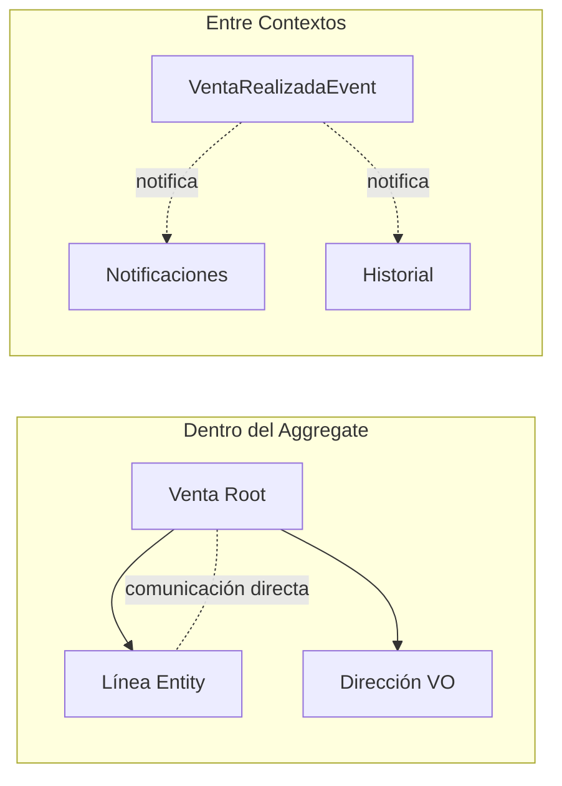

# 📗 Concept: Domain-Driven Design (DDD)
> **Tags:** #engineering #learning #pkm #ddd #architecture
> **Type:** Architecture / Pattern

## 📖 The 80/20 Essence (Resumen Core)

DDD es una filosofía de diseño de software que dice: **el código debe hablar el mismo idioma que el negocio**. No se trata de tecnología ni de frameworks — se trata de que el modelo en código refleje fielmente las reglas y conceptos del dominio (el negocio).

Se compone de dos partes:

### DDD Estratégico (los límites)
- **Bounded Contexts:** Límites explícitos donde un modelo de dominio tiene sentido. Un mismo concepto ("Cliente", "Producto") puede tener modelos distintos en contextos distintos.
- **Context Mapping:** Patrones de relación entre bounded contexts (Customer-Supplier, Anti-Corruption Layer, Conformist, Partnership).
- **Regla clave:** Un Bounded Context = un microservicio (en la mayoría de los casos).

### DDD Táctico (los Building Blocks)

Los Building Blocks se organizan en categorías según su naturaleza:

#### 1. Identidad propia (se definen por sí mismos)
| Building Block | Qué es | Ejemplo en negocio de hardware |
|---|---|---|
| **Entity** | Identidad importa, **mutable**. Se compara por ID. | GPU en Garantía (importa CUÁL específica), Empleado (tiene DNI único) |
| **Value Object** | Atributos importan, **inmutable**. Si cambia, es un nuevo objeto. | GPU en Ventas (misma spec = misma GPU, no importa cuál), Dirección de entrega |

**Prueba decisiva:** Si dos objetos tienen los mismos atributos, ¿son intercambiables? Si sí → Value Object. Si no → Entity.

#### 2. Consistencia en conjunto (existen como grupo coherente)
| Building Block | Qué es | Ejemplo |
|---|---|---|
| **Aggregate** | Borde de consistencia — objetos que deben cambiar juntos o no cambiar. La Venta y sus Líneas tienen que ser consistentes (el total tiene que reflejar lo que tiene adentro). | Línea de venta GPU RTX 4070 dentro de una Venta |
| **Aggregate Root** | El guardian — la única puerta de entrada al Aggregate. Protege las reglas del negocio. Nada se modifica dentro sin pasar por él. | Venta (Root): las líneas se agregan o modifican SIEMPRE a través de la Venta |

**Regla:** Un Aggregate Root SIEMPRE es una Entity (si no tiene identidad, ¿cómo lo buscás desde afuera?). Los Value Objects pueden estar dentro de un Aggregate, pero nunca ser el Root.

#### 3. Comunicación entre contextos
| Building Block | Qué es | Ejemplo |
|---|---|---|
| **Domain Event** | Un registro de un **hecho del negocio que ya ocurrió**, inmutable, que permite que otros contextos reaccionen. | `VentaRealizadaEvent`, `TurnoCreadoEvent` |

Es un **Value Object** — inmutable, definido por atributos, no se modifica. **Se nombra en pasado**. Si algo cambió, se emite un evento NUEVO, no se edita el viejo.

No es la Entity, no es el Aggregate — es como una factura: certifica que algo pasó y otros la usan para reaccionar.

**Dentro del Aggregate → comunicación directa.** La Venta conoce sus líneas, no necesita un Event para hablar con ellas.
**Entre Aggregates o contextos → Domain Events.** `TurnoCreadoEvent` avisa al contexto de Notificaciones, al de Historial, etc.

#### 4. Recuperación
| Building Block | Qué es | Ejemplo |
|---|---|---|
| **Repository** | El bibliotecario — se encarga de guardar y recuperar Aggregates. La Entity nunca sabe cómo se persiste. La interfaz vive en Domain, la implementación en Infrastructure. | `VentaRepository` |

#### 5. Lógica sin hogar
| Building Block | Qué es | Ejemplo |
|---|---|---|
| **Domain Service** | Regla de negocio que no pertenece a ninguna Entity ni Value Object individual. Es su **propia clase** en Domain con nombre que describe la regla. | `DisponibilidadProducto` — "no se vende sin stock" involucra Venta Y Stock, no pertenece a ninguna de las dos |

**No confundir con Application Service:** El Domain Service tiene la regla de negocio. El Application Service solo orquesta (llama reglas en orden, no tiene reglas propias).

**Flujo completo:**
```
Controller → Application Service → Domain (Entities, VOs, Domain Services, Events)
                                ↕
                          Repository (persistencia)
```

### 🏆 Regla de oro: Todo depende del contexto del negocio

Un mismo objeto del mundo real **cambia su rol** según el contexto:

| Objeto | En Ventas (mostrador) | En Garantía |
|--------|----------------------|--------------|
| GPU RTX 4070 | **Value Object** — misma spec = misma GPU, no importa cuál | **Entity** — importa CUÁL específica, ¿cuál se llevó el cliente? |

| Objeto | En RRHH | En Facturación |
|--------|---------|---------------|
| Empleado | **Entity** — identidad importa (DNI, email únicos) | Depende del contexto — puede ser "vendedor1" genérico |

Los límites donde un modelo tiene significado unívoco y consistente son los **Bounded Contexts** (próximo tema).

## 🎯 Context & Evolution (Evolución y Contexto)

| Era | Enfoque | Problema |
|-----|---------|----------|
| **Legacy (Anémico)** | Clases con getters/setters, lógica en servicios, nombres técnicos (`OrderDTO`, `setStatus`) | El código no refleja el negocio; los devs y el negocio hablan idiomas distintos |
| **DDD (Rico en dominio)** | Clases con comportamiento, lenguaje ubicuo, nombres de negocio (`Pedido.confirmar()`) | El código ES el negocio; cualquier stakeholder puede leerlo y entenderlo |

## ⚖️ Trade-offs (Ventajas y Desventajas)

- **Pros:**
  - Código que refleja el negocio → más fácil de mantener y extender
  - Límites claros (Bounded Contexts) → base natural para microservicios
  - Aggregates como unidades de consistencia → menos bugs por estados inválidos
  - Domain Events → comunicación desacoplada entre componentes

- **Cons:**
  - Curva de aprendizaje significativa
  - Over-engineering si el dominio es simple (CRUD básico)
  - Requiere colaboración cercana con expertos del negocio
  - No todos los problemas necesitan DDD completo

## 🗺️ Visual Logic (Diagrama Mermaid)

```mermaid
graph TB
    subgraph "Bounded Context: Ventas"
        V[Venta Aggregate Root] --> LV[Línea de Venta Entity]
        V --> DV[DirecciónEnvio VO]
        V --> VRE[VentaRealizadaEvent]
        VRepo[VentaRepository] -. V
        DS[DisponibilidadProducto Domain Service] -. usada por .- AppSrv
    end

    subgraph "Bounded Context: Garantía"
        GPU[GPU Entity - importa CUÁL]
    end

    subgraph "Bounded Context: Stock"
        PROD[Producto VO - misma spec = mismo]
    end

    AppSrv[VentaAppService] --> V
    AppSrv --> DS
    VRE -. notifica .- Notificaciones
    VRE -. notifica .- Historial
```



## 💡 Engineering Insight (Lección Clave)

**DDD no es sobre código — es sobre comunicación.** Si tu equipo no puede nombrar un concepto del negocio sin ambigüedad, ningún patrón técnico va a salvar el proyecto. Empezá por el lenguaje, no por la arquitectura.

**La regla que conecta todo:** Un mismo concepto del mundo real cambia su rol (Entity, Value Object, Aggregate Root, Event) según el **contexto del negocio** en el que estés. No existe "GPU es Entity" o "GPU es Value Object" en absoluto — depende del contexto. Esto es la puerta de entrada a Bounded Contexts.

**Regla práctica:** Si no podés explicar tu Aggregate a un experto del negocio en 2 minutos, probablemente está mal diseñado.

## 🔗 Related Concepts
- [[acoplamiento]] — Extension: DDD reduce el acoplamiento mediante Bounded Contexts y Domain Events entre contextos
- [[bounded-contexts]] — Detail: Los Bounded Contexts son la unidad fundamental de DDD Estratégico. El límite donde cambia el lenguaje.
- [[microservicios]] — Prerequisite: DDD es la base para definir los límites correctos de cada microservicio
- [[clean-architecture]] — Extension: Domain (Entities, VOs, Domain Services, Events) es el corazón; Application Service orquesta; Repository persiste

---

## ✍️ Mi Resumen Personal

Los Building Blocks de DDD se dividen en 5 categorías:
1. **Identidad propia:** Entity (identidad importa, mutable) y Value Object (atributos importan, inmutable)
2. **Consistencia en conjunto:** Aggregate (borde de consistencia) y Aggregate Root (guardian, única puerta de entrada)
3. **Comunicación entre contextos:** Domain Event (registro de hecho ocurrido, inmutable, como una factura)
4. **Recuperación:** Repository (el bibliotecario, interfaz en Domain, implementación en Infrastructure)
5. **Lógica sin hogar:** Domain Service (regla de negocio que no pertenece a ninguna Entity, su propia clase en Domain)

No confundir Domain Service con Application Service: el primero tiene la regla de negocio, el segundo solo orquesta.

La regla de oro: un mismo objeto del mundo real cambia su rol según el contexto del negocio. Una GPU puede ser Value Object, Entity, o línea de un Aggregate dependiendo de dónde estés parado.
