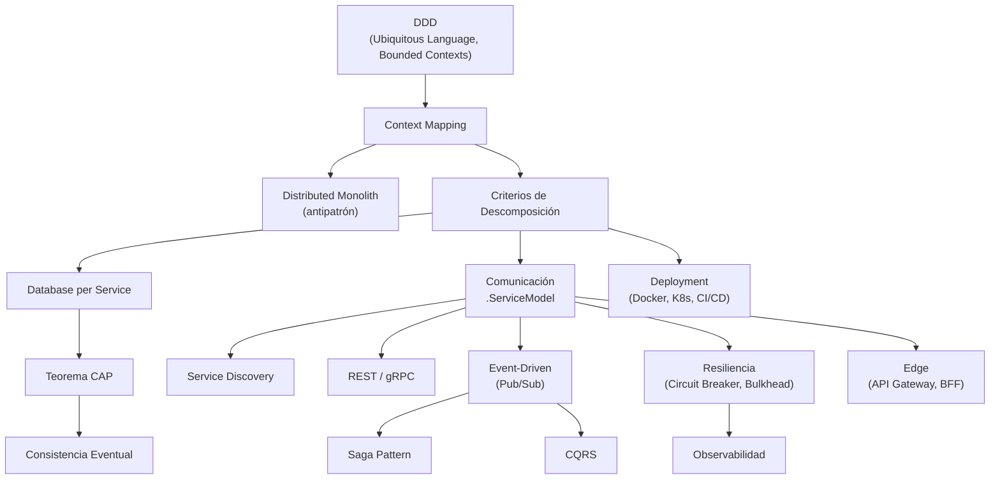

# 🗺️ Concept Map: Microservicios con Java 21 + Spring Boot 3

> **Created:** 2026-05-23
> **Source:** `00-to-study/Microservicios.md` roadmap + sesiones previas DDD + Acoplamiento

---

## Estado de Conocimiento

| Área | Sub-concepto | Estado | Notas |
|------|-------------|--------|-------|
| **Fase 0: Fundamentos** | Ubiquitous Language | ✅ Dominado | Sesión 2026-05-01 |
| | Entity, VO, Aggregate, Domain Event | ✅ Dominado | Refuerzo 2026-05-06 |
| | Repository, Domain Service, App Service | ✅ Dominado | Clarificado Domain vs App Service |
| | Bounded Context (concepto) | ✅ Dominado | Sesión 2026-05-11 |
| | Bounded Context (delimitación por lenguaje) | ✅ Dominado | "El límite es dónde cambia el lenguaje" |
| | Inter-context communication | ✅ Dominado | Compartir IDs, crear cuando se necesita |
| | **Context Mapping** | ⬜ Pendiente | Patrones: Partnership, Customer-Supplier, Conformist, ACL |
| | Distributed Monolith (antipatrón) | ⬜ Pendiente | Conecta con acoplamiento ✅ |
| | Criterios de descomposición | ⬜ Pendiente | Negocio vs técnico, deploy independiente |
| **Fase 1: Datos** | Database per Service | ⬜ Pendiente | |
| | Consistencia Eventual | 🔵 Parcial | Mencionado en sesión de acoplamiento |
| | Teorema CAP | ⬜ Pendiente | |
| **Fase 2: Comunicación** | Service Registry & Discovery | ⬜ Pendiente | |
| | REST + OpenAPI | ⬜ Pendiente | |
| | gRPC + Protobuf | ⬜ Pendiente | |
| | Event-Driven (Pub/Sub) | 🔵 Parcial | Events como concepto ✅, EDA como patrón ⬜ |
| | Message Brokers (Kafka vs RabbitMQ) | ⬜ Pendiente | |
| **Fase 3: Edge** | API Gateway | ⬜ Pendiente | |
| | BFF (Backend for Frontend) | ⬜ Pendiente | |
| | API Versioning | ⬜ Pendiente | |
| **Fase 4: Transacciones** | Saga Pattern (Coreografiada vs Orquestada) | ⬜ Pendiente | |
| | CQRS (lógico vs físico) | ⬜ Pendiente | |
| **Fase 5: Resiliencia** | Circuit Breaker | ⬜ Pendiente | |
| | Fallback, Retries, Exponential Backoff | ⬜ Pendiente | |
| | Bulkhead | ⬜ Pendiente | |
| | Rate Limiting | ⬜ Pendiente | |
| **Fase 6: Observabilidad** | Distributed Tracing | ⬜ Pendiente | |
| | Logging estructurado | ⬜ Pendiente | |
| | Métricas (RED, USE) | ⬜ Pendiente | |
| | SLOs/SLIs/SLAs | ⬜ Pendiente | |
| **Fase 7: Deployment** | Docker + Kubernetes conceptos | ⬜ Pendiente | |
| | Estrategias de Deployment | ⬜ Pendiente | |
| | Config Server + Secrets | ⬜ Pendiente | |
| | CI/CD + Contract Testing | ⬜ Pendiente | |

## Dependencias entre Conceptos

## Conexiones con Temas Previos

- **Acoplamiento ✅** → Directamente conecta con: Database per Service, Context Mapping, Event-Driven vs Synchronous, Distributed Monolith
- **Domain Events ✅** → Base para: Event-Driven Architecture, Saga Coreografiada, CQRS, inter-context communication
- **Bounded Contexts ✅** → Base para: Descomposición de microservicios, Database per Service, API boundaries